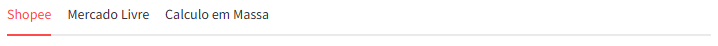
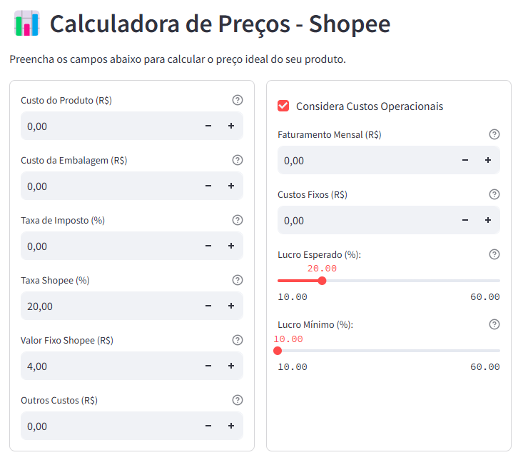

# Guia de Uso

## Abas Principais

### Shopee
- **Calculo Unitário**: Calcule o preço de venda de um único produto na Shopee.
- **Calculo em Massa**: Calcule o preço de venda para vários produtos na Shopee.

### Mercado Livre
- Calcule o preço de venda de produtos no Mercado Livre.

## Passo a Passo

1. **Acesse o App**:
    - Acesse o [Site da Calculadora de Preços E-commerce](https://ecommerce-price-calculator.streamlit.app/).

2. **Selecione a Aba**:
    - Escolha entre "Shopee" ou "Mercado Livre".

    

    - Selecione a sub aba para escolher entre o cálculo uniário ou cálculo em massa

    

### **Para cálculo unitário**
1. **Preencha os Campos**:
    - Insira os dados do produto, como custo do produto, taxas e custos operacionais.  
    - Use o slicer para escolher a porcentagem de lucro esperada e a porcentagem de lucro mínimo
    
    
    
2. **Visualize os Resultados**:
    - O app exibirá logo abaixo em tempo real o preço de venda sugerido e outras informações detalhadas.

### **Campos Utilizados**
[Campos Utilizados](../campos_utilizados)

### **Para cálculo em massa**

1. **Preencha os Campos**:
    - Insira os dados do produto, como taxas e custos operacionais.
    - Use o slicer para escolher a porcentagem de lucro esperada e a porcentagem de lucro mínimo

2. **Baixar arquivo de exemplo**:
    - Clique no botão de donwload para baixar o arquivo de exemplo, já padronizado com os campos e os formatos necessários
    - Preencha o arquivo baixado com seus produtos e custos

3. **Fazer upload do arquivo**:
    - Após preencher e salvar o arquivo baixado com seus dados, faça o upload arrastando o arquivo na área cinza ou clicando em "Browse Files"

4. **Exibição dos resultados**
    - O aplicativo exibirá logo abaixo uma tabela com os resultados da análise. O máximo de produtos exibidos são 15.

5. **Download do resultado**
    - Caso tenha mais de 15 produtos, você pode baixar o resultado completo clicando em "Exportar para Excel" para baixar o resultado completo